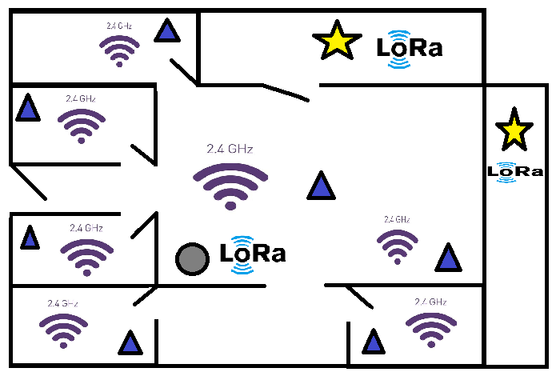

# LoRa based communication for Smart Home IoT implementation
## [TEL329] Redes de sensores
### Description

Proyecto destinado a diseñar e implementar una SmartHome.

### Details

* Backend: Node.js - Express.js
* FrontEnd: Angular.js
* BD: MySQL

